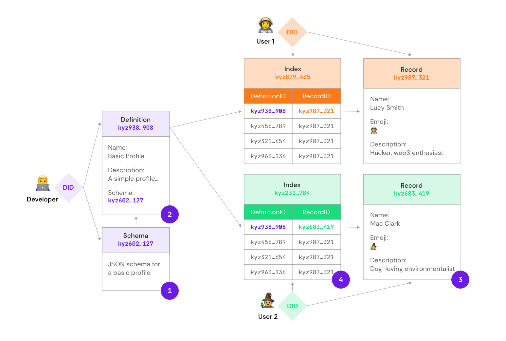

# Overview

IDX is an identity protocol for open applications. It provides a decentralized [index](#index) which allows structured data to be associated to a decentralized identifier ([DID](glossary.md#did)). Data is defined by [definitions](#definition) and stored in [records](#record).


## **Components**

### Index

The [index](glossary.md#index) is a key-value document which stores a list of [definitionID](glossary.md#definitionid) to [recordID](glossary.md#recordid) mappings.

```json
{
  "kyz123...456": "ceramic://kyz789...012",
  "kyz345...678": "ceramic://kyz901...234",
  "kyz567...890": "ceramic://kyz123...456",
  "kyz789...012": "ceramic://kyz345...678"
}
```

### Definition

A [definition](glossary.md#definition) is a document which describes a [record](#record). It is identified by a [definitionID](glossary.md#definitionid).

```js
{
  name: 'Basic Profile',
  description: 'A simple basic profile.',
  schema: 'kyz...'
}
```

### Schema

A [schema](glossary.md#schema) is a document which contains a [JSON schema](https://json-schema.org/). It specifies the data format of a [record](#record). It is identified by a [schemaURL](glossary.md#schemaurl) which is included in a [definition](#definition).

```json
{
  "$schema": "http://json-schema.org/draft-07/schema#",
  "title": "BasicProfile",
  "type": "object",
  "properties": {
    "name": {
      "type": "string",
      "maxLength": 150
    },
    "image": {
      "$ref": "#/definitions/imageSources"
    },
    "description": {
      "type": "string",
      "maxLength": 420
    },
    "emoji": {
      "type": "string",
      "maxLength": 2
    },
    "background": {
      "$ref": "#/definitions/imageSources"
    },
    "birthDate": {
      "type": "string",
      "format": "date",
      "maxLength": 10
    },
    "url": {
      "type": "string",
      "maxLength": 240
    },
    "gender": {
      "type": "string",
      "maxLength": 42
    },
    "homeLocation": {
      "type": "string",
      "maxLength": 140
    },
    "residenceCountry": {
      "type": "string",
      "pattern": "^[A-Z]{2}$",
      "maxLength": 2
    },
    "nationalities": {
      "type": "array",
      "minItems": 1,
      "items": {
        "type": "string",
        "pattern": "^[A-Z]{2}$",
        "maxItems": 5
      }
    },
    "affiliations": {
      "type": "array",
      "items": {
        "type": "string",
        "maxLength": 140
      }
    }
  },
  "definitions": {
    "IPFSUrl": {
      "type": "string",
      "pattern": "^ipfs://.+",
      "maxLength": 150
    },
    "positiveInteger": {
      "type": "integer",
      "minimum": 1
    },
    "imageMetadata": {
      "type": "object",
      "properties": {
        "src": {
          "$ref": "#/definitions/IPFSUrl"
        },
        "mimeType": {
          "type": "string",
          "maxLength": 50
        },
        "width": {
          "$ref": "#/definitions/positiveInteger"
        },
        "height": {
          "$ref": "#/definitions/positiveInteger"
        },
        "size": {
          "$ref": "#/definitions/positiveInteger"
        }
      },
      "required": ["src", "mimeType", "width", "height"]
    },
    "imageSources": {
      "type": "object",
      "properties": {
        "original": {
          "$ref": "#/definitions/imageMetadata"
        },
        "alternatives": {
          "type": "array",
          "items": {
            "$ref": "#/definitions/imageMetadata"
          }
        }
      },
      "required": ["original"]
    }
  }
}
```

### Record

A [record](glossary.md#record) is a document which contains data specified by a definition. It is identified by a [recordID](glossary.md#recordid).

```js
{
  name: 'Alan Turing',
  description: 'I make computers beep good.',
  emoji: '💻'
}
```

## **How it works**

### Writing records

1. Developer creates a [schema](#schema).
1. Developer creates a [definition](#definition) and includes the [schemaURL](glossary.md#schemaurl).
1. User creates a [record](#record) that conforms to the definition.
1. User adds the [definitionID](glossary.md#definitionid) and [recordID](glossary.md#recordid) to their [index](#index).

> Learn more about [writing records](../build/writing.md).



### Reading records

1. Developer queries an [index](#index) using a [DID](glossary.md#did) and a [definitionID](glossary.md#definitionid) or [alias](glossary.md#alias).
1. Developer gets back the [record](#record) that corresponds to the definitionID.

> Learn more about [reading records](../build/reading.md).


## **Why IDX?**

#### **Eliminate user identities from your server.**

By relying on [DIDs](glossary.md#did) for identifiers and [indexes](#index) for user tables, you can greatly reduce the amount of sensitive identity information stored on your servers and instead rely on the trust and security of decentralized protocols.

#### **Discover and import data from other applications.**

Unified identities allow you to query a user's [index](#index) and get access to their entire catalog of data regardless of where the data is stored, what type of database was used, or which application first created the data. This simplifies onboarding by allowing you to bootstrap your application with a rich data set.

#### **Store data wherever you want.**

The [index](#index) seamlessly integrates with all databases and storage backends so you can choose to store information in whichever technology or combination of technologies best suits the needs of your application.

#### **Easily make your data available to other applications.**

By adding your application's data to the [indexes](#index) of your users, you are adding it to a global catalog where it can conveniently be consumed by every other application that uses the IDX protocol withouot requiring difficult, one-off data integrations.

#### **Seamless integration with all Web3 technologies and blockchains.**

IDX's cross-ecosystem, technology-agnostic identity protocol seamlessly integrates with all Web3 wallets, blockchain networks, and decentralized storage platforms. IDX identities unify the Web3 ecosystem and deliver seamless cross-platform user experiences.

#### **Build with standards and flexible, open source technology.**

Identity is one of the most important architectural decisions you can make for your project. IDX ensures this is a future-proof one by being flexible, cross-platform, open source, and having strong community support.
