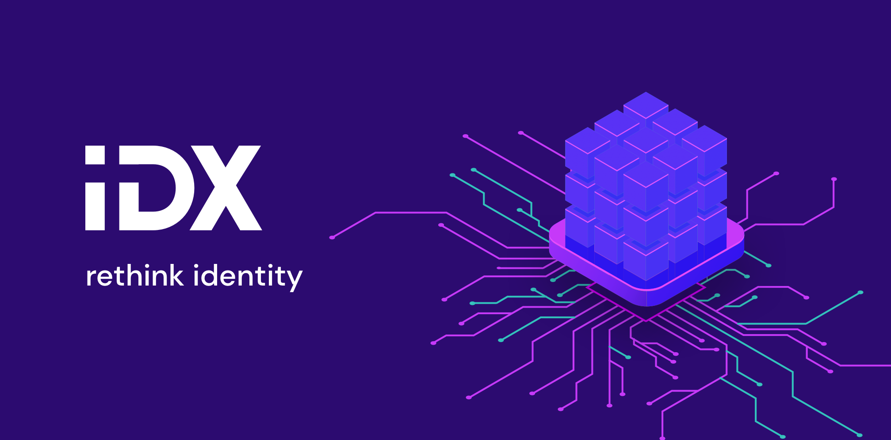

!!! warning ""
:octicons-alert-16: IDX is in alpha. Libraries may be unstable and APIs are subject to change.

# Identity protocol for open applications

The web is evolving. As we transition from closed platforms with app-specific identities and siloed information to open ecosystems with user-owned identities and portable data, we need a fundamental redesign of how we manage identities and data online.

IDX is an open source decentralized identity protocol that replaces app-specific user tables with a single user-centric index that is shared by all applications. The index provides a unified place where all applications can register and discover data sources associated to a user. The index allows your application to store data in any storage backend, while still providing users with the aggregation, metadata, schemas, and routing required to make this data consumable by any other application.

Whether you're developing a fully-featured application that gives users control and portability over their data, building a project that imports existing user data, or just want to learn more about decentralized identity and the IDX protocol, our documentation site has the tools for you.

## Getting started

[Quick start](../build/quick-start.md){: .md-button .md-button--primary } [Installation](../build/installation.md){: .md-button .md-button--primary }

## Learn the basics

[Overview](overview.md){: .md-button } [Glossary](../build/installation.md){: .md-button }

## Development Tools

[JS SDK](../build/installation.md){: .md-button } [CLI](../build/installation.md){: .md-button } [API Reference](../build/installation.md){: .md-button }

## Resources

[:material-forum: Developer chat](../build/installation.md){: .md-button } [:octicons-octoface-16: Github](../build/installation.md){: .md-button } [:material-twitter: Twitter](../build/installation.md){: .md-button }

## License

IDX is fully open source and dual-licensed under [MIT]() and [Apache 2]().
